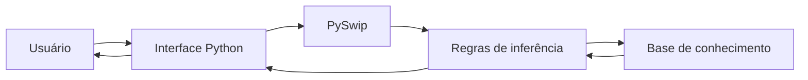

# Arquitetura do Sistema

## Visão geral

O sistema utiliza uma arquitetura híbrida entre **Python** e **Prolog**.

O Python é responsável pelas interfaces e pela interação com o usuário. O Prolog armazena a base de conhecimento e executa as regras que calculam a compatibilidade entre sintomas e doenças.

## Componentes principais

| Arquivo | Responsabilidade |
|---|---|
| `main.py` | Interface executada pelo terminal |
| `python/interface.py` | Interface gráfica desenvolvida com CustomTkinter |
| `prolog/base_conhecimento/doencas.pl` | Armazena doenças, sintomas, pesos e sintomas obrigatórios |
| `prolog/regras/inferencia.pl` | Calcula e ordena as compatibilidades |
| `prolog/regras/diagnostico.pl` | Reservado para regras complementares |

## Estrutura do projeto

```text
projeto/
├── main.py
├── python/
│   ├── __init__.py
│   └── interface.py
├── prolog/
│   ├── base_conhecimento/
│   │   └── doencas.pl
│   └── regras/
│       ├── inferencia.pl
│     
├── docs/
└── tests/
```

## Comunicação entre Python e Prolog

A integração é realizada pela biblioteca **PySwip**.

O Python carrega o arquivo `inferencia.pl` e envia os sintomas selecionados pelo usuário por meio da consulta:

```prolog
diagnosticar([febre, tosse, dor_cabeca], Resultado).
```

O Prolog consulta `doencas.pl`, calcula a compatibilidade e devolve um ranking de possíveis doenças.

## Fluxo do sistema



O funcionamento segue estas etapas:

1. O usuário seleciona os sintomas;
2. O Python envia os sintomas ao Prolog;
3. O Prolog consulta a base de conhecimento;
4. Os pesos dos sintomas correspondentes são somados;
5. Doenças sem sintomas obrigatórios são eliminadas;
6. Os resultados são ordenados por compatibilidade;
7. A interface apresenta o ranking ao usuário.

## Cálculo da compatibilidade

Cada sintoma possui um peso de `1` a `5`. A porcentagem é calculada usando:

```text
Compatibilidade = (peso dos sintomas encontrados ÷ peso total da doença) × 100
```

Essa porcentagem representa apenas a correspondência entre os sintomas informados e os dados cadastrados.

> O sistema possui finalidade educacional e não substitui uma avaliação ou um diagnóstico médico.