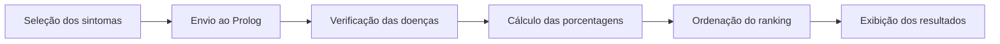

# Funcionamento do Sistema

## Visão geral

O sistema recebe os sintomas selecionados pelo usuário e utiliza regras escritas em Prolog para gerar um ranking de possíveis doenças.

Ele pode ser utilizado por meio de:

- `main.py`: interface no terminal;
- `python/interface.py`: interface gráfica com CustomTkinter.

## Etapas de funcionamento

1. O Python inicia a aplicação;
2. O arquivo `inferencia.pl` é carregado pelo PySwip;
3. O Prolog carrega a base `doencas.pl`;
4. Os sintomas disponíveis são apresentados ao usuário;
5. O usuário seleciona um ou mais sintomas;
6. O Python envia os sintomas ao Prolog;
7. O Prolog calcula a compatibilidade de cada doença;
8. Os resultados são ordenados da maior para a menor porcentagem;
9. O Python apresenta o ranking ao usuário.

## Processamento no Prolog

A base de conhecimento registra cada sintoma desta forma:

```prolog
sintoma(Doenca, Sintoma, Peso, Obrigatorio).
```

Exemplo:

```prolog
sintoma(dengue, febre, 4, sim).
sintoma(dengue, dor_muscular, 3, nao).
```

O peso indica a importância do sintoma. Quando um sintoma é marcado como obrigatório (`sim`), a doença somente participa do resultado se esse sintoma tiver sido selecionado.

A consulta principal é:

```prolog
diagnosticar(SintomasInformados, Resultados).
```

## Cálculo da compatibilidade

A porcentagem é calculada por meio da fórmula:

```text
Compatibilidade = (peso obtido ÷ peso total da doença) × 100
```

Depois do cálculo, os resultados são ordenados da maior para a menor compatibilidade.

## Fluxo resumido



> Os resultados possuem finalidade educacional e não substituem uma consulta ou um diagnóstico médico.